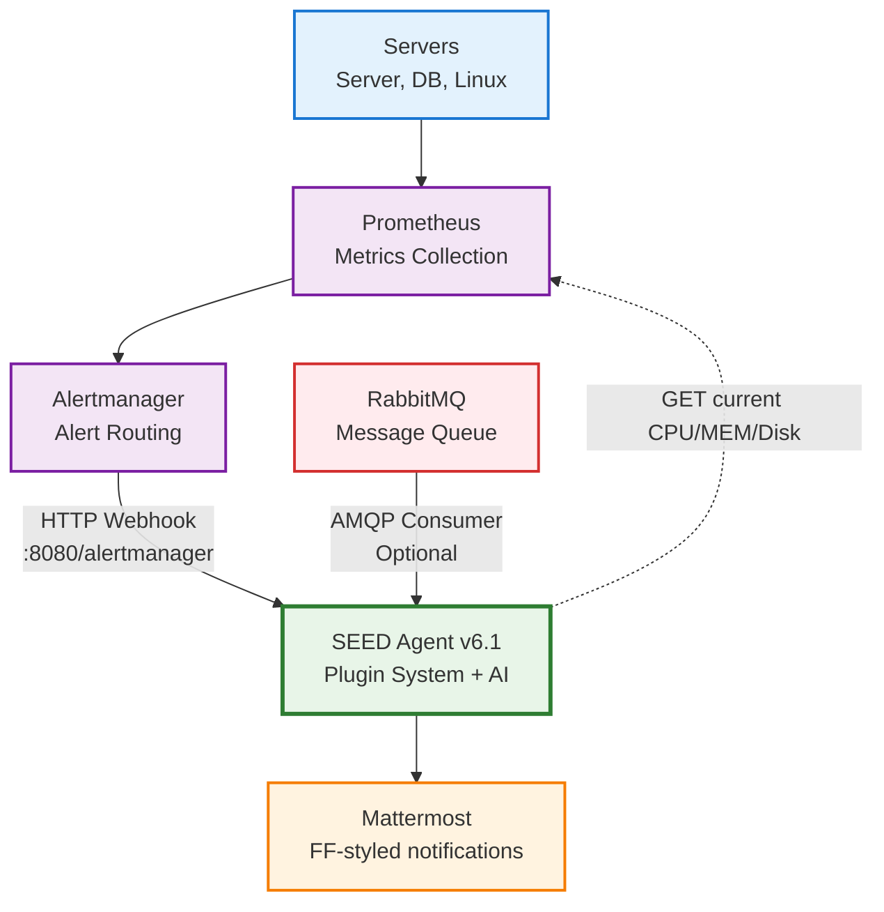
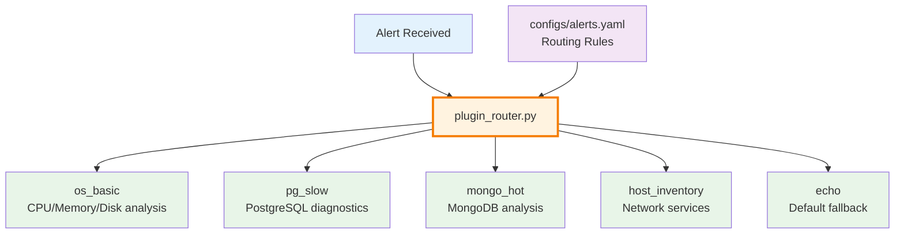
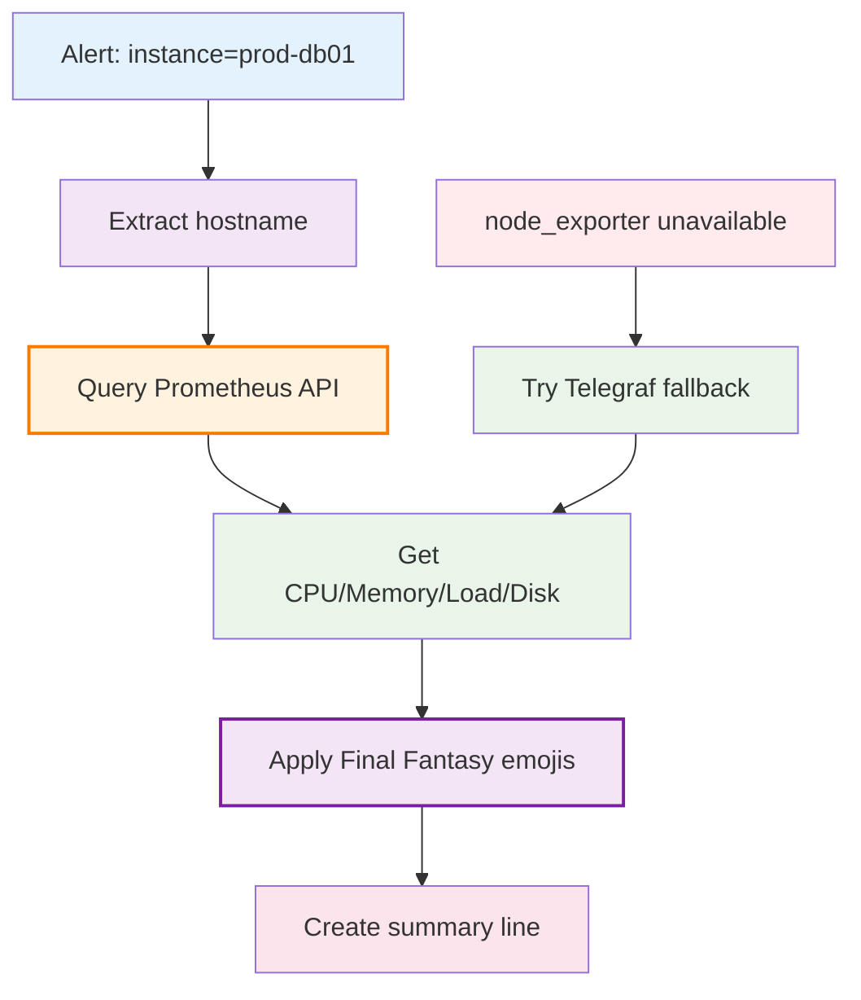

```mermaid
flowchart LR
    A["Alert Received<br/>PostgresSlowQuery"] --> B["Plugin Router<br/>Route to pg_slow"]
    B --> C["Enrichment<br/>Query Prometheus<br/>for current metrics"]
    C --> D["Final Fantasy Styling<br/>Apply CPU/MEM/DISK emojis"]
    D --> E["AI Analysis<br/>GigaChat recommendations"]
    E --> F["Format Message<br/>Beautiful output"]
    F --> G["Send to Mattermost<br/>Channel notification"]
    
    classDef process fill:#e3f2fd,stroke:#1976d2,stroke-width:2px
    classDef styling fill:#f3e5f5,stroke:#7b1fa2,stroke-width:2px
    classDef ai fill:#fff3e0,stroke:#f57c00,stroke-width:2px
    classDef output fill:#e8f5e8,stroke:#2e7d32,stroke-width:2px
    
    class A,B,C process
    class D styling
    class E ai
    class F,G output
```

# 🌌 S.E.E.D. Agent v6.1 - Mermaid Architecture Diagram

## 🚀 Simple Overview (WORKING)

## ⚔️ Alert Processing Flow (WORKING)

## 🎮 Plugin System Detail

## 💎 Enrichment Process

## 🚀 Usage Instructions

1. Copy any of the diagrams above
2. Paste into GitHub README.md, GitLab, or any Mermaid-supported platform
3. The diagrams will render automatically
4. For presentations, use mermaid.live or mermaid-js.github.io to export as PNG/SVG

## 🎮 Features Highlighted

- **🌌 S.E.E.D. Agent** as central processing hub
- **🎮 Final Fantasy styling** with emoji progressions  
- **🔧 Plugin system** with specialized handlers
- **💎 Smart enrichment** with Prometheus integration
- **🧠 AI analysis** via GigaChat LLM
- **📱 Beautiful output** to Mattermost