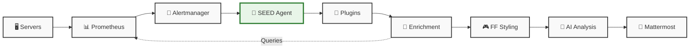
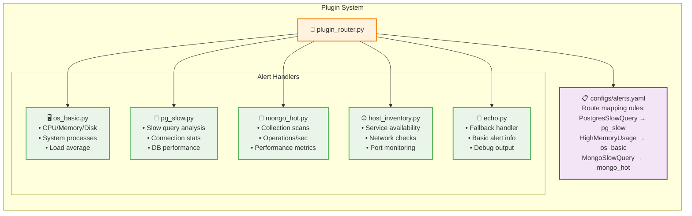

# 🌌 S.E.E.D. Agent v6.1 - Mermaid Architecture Diagram

## 🎮 Full Architecture Flow

```mermaid
graph TD
    %% Infrastructure Layer
    subgraph INFRA[🖥️ Infrastructure Layer]
        PG[🐘 PostgreSQL<br/>prod-db01]
        MONGO[🍃 MongoDB<br/>prod-mongo01] 
        LINUX[🖥️ Linux Servers<br/>nt-smi-mng-sc-msk03]
        
        NODE[📊 node_exporter:9100]
        TELE[📊 telegraf:9216]
        PGEXP[📊 postgres_exporter]
        MONGOEXP[📊 mongodb_exporter]
    end
    
    %% Monitoring Layer  
    subgraph MON[📊 Monitoring Layer]
        PROM[🔍 Prometheus<br/>Metrics Storage<br/>+ Alert Rules]
    end
    
    %% Alerting Layer
    subgraph ALERT[🚨 Alerting Layer] 
        AM[📢 Alertmanager<br/>Alert Routing<br/>& Grouping]
    end
    
    %% SEED Agent Core
    subgraph SEED[🌌 S.E.E.D. Agent v6.1]
        %% Input Layer
        subgraph INPUT[📥 Input Layer]
            HTTP[HTTP Webhook<br/>:8080/alertmanager]
            RABBIT[RabbitMQ Consumer<br/>Optional]
        end
        
        %% Routing Layer
        ROUTER[🧭 Plugin Router<br/>configs/alerts.yaml<br/>Maps alerts → plugins]
        
        %% Processing Layer
        subgraph PLUGINS[🔧 Plugin System]
            OS[🖥️ os_basic<br/>CPU/Memory/Disk/Load]
            PG_PLUGIN[🐘 pg_slow<br/>PostgreSQL Analysis]
            MONGO_PLUGIN[🍃 mongo_hot<br/>MongoDB Analysis] 
            HOST[🌐 host_inventory<br/>Network Services]
            ECHO[📢 echo<br/>Fallback Handler]
        end
        
        %% Enrichment Layer
        ENRICH[💎 Enrichment Layer<br/>enrich.py<br/>Prometheus Queries<br/>+ Telegraf Fallback]
        
        %% Styling Layer  
        STYLE[🎮 Final Fantasy Styling<br/>⚔️ CPU: ✨→⚔️→🗡️→💎🔥<br/>🧙‍♂️ MEM: 🌟→🛡️→🏰→💎🔥<br/>⚙️ DISK: ✨→🛡️→⚔️→💎🔥]
        
        %% AI Layer
        AI[🧠 GigaChat LLM<br/>Магия кристалла<br/>Context Analysis<br/>Recommendations]
        
        %% Formatting Layer
        FORMAT[📝 Message Formatter<br/>Structured Output<br/>No Metric Duplication]
    end
    
    %% Delivery Layer
    subgraph DELIVERY[💬 Delivery Layer]
        MM[📱 Mattermost<br/>#alerts-seed<br/>Beautiful FF-styled<br/>notifications]
    end

    %% Data Flow Connections
    PG --> NODE
    PG --> PGEXP
    MONGO --> MONGOEXP
    LINUX --> NODE
    LINUX --> TELE
    
    NODE --> PROM
    TELE --> PROM  
    PGEXP --> PROM
    MONGOEXP --> PROM
    
    PROM --> AM
    AM --> HTTP
    AM --> RABBIT
    
    HTTP --> ROUTER
    RABBIT --> ROUTER
    
    ROUTER --> OS
    ROUTER --> PG_PLUGIN  
    ROUTER --> MONGO_PLUGIN
    ROUTER --> HOST
    ROUTER --> ECHO
    
    OS --> ENRICH
    PG_PLUGIN --> ENRICH
    MONGO_PLUGIN --> ENRICH
    HOST --> ENRICH
    ECHO --> ENRICH
    
    ENRICH --> STYLE
    STYLE --> AI
    AI --> FORMAT
    FORMAT --> MM
    
    %% Back-connection for metrics enrichment
    ENRICH -.->|Queries for<br/>current metrics| PROM
    
    %% Styling
    classDef infrastructure fill:#e1f5fe,stroke:#01579b,stroke-width:2px
    classDef monitoring fill:#f3e5f5,stroke:#4a148c,stroke-width:2px  
    classDef alerting fill:#fff3e0,stroke:#e65100,stroke-width:2px
    classDef seed fill:#e8f5e8,stroke:#2e7d32,stroke-width:3px
    classDef delivery fill:#fce4ec,stroke:#c2185b,stroke-width:2px
    
    class INFRA,PG,MONGO,LINUX,NODE,TELE,PGEXP,MONGOEXP infrastructure
    class MON,PROM monitoring
    class ALERT,AM alerting  
    class SEED,INPUT,HTTP,RABBIT,ROUTER,PLUGINS,OS,PG_PLUGIN,MONGO_PLUGIN,HOST,ECHO,ENRICH,STYLE,AI,FORMAT seed
    class DELIVERY,MM delivery
```

## 🎯 Simplified Data Flow



## 🌟 Alert Processing Detail

```mermaid
graph TD
    subgraph ALERT_FLOW[Alert Processing Flow]
        A1[📨 Alert Received<br/>alertname: PostgresSlowQuery<br/>instance: prod-db01<br/>severity: critical]
        
        A2[🧭 Router Analysis<br/>Check configs/alerts.yaml<br/>Match: alertname = PostgresSlowQuery]
        
        A3[🔧 Plugin Selection<br/>Route to: pg_slow plugin<br/>params: {top: 5, show_host_metrics: true}]
        
        A4[💎 Enrichment Process<br/>Query Prometheus:<br/>• CPU usage from prod-db01<br/>• Memory usage<br/>• Load average<br/>• Disk usage /data]
        
        A5[🎮 Apply FF Styling<br/>🗡️ CPU: 75% = 🗡️<br/>🏰 MEM: 82% = 🏰<br/>✨ DISK: 34% = ✨]
        
        A6[🧠 AI Analysis<br/>GigaChat context:<br/>PostgreSQL slow queries + high CPU/MEM<br/>Generate recommendations]
        
        A7[📝 Format Message<br/>🌌 S.E.E.D. header<br/>📊 Summary line with FF emojis<br/>🔧 Plugin diagnostics<br/>🧠 AI recommendations]
        
        A8[📱 Send to Mattermost<br/>Channel: #alerts-seed<br/>Beautiful formatted notification]
    end
    
    A1 --> A2 --> A3 --> A4 --> A5 --> A6 --> A7 --> A8
    
    classDef process fill:#e3f2fd,stroke:#1976d2,stroke-width:2px
    classDef ai fill:#f3e5f5,stroke:#7b1fa2,stroke-width:2px
    classDef output fill:#e8f5e8,stroke:#388e3c,stroke-width:2px
    
    class A1,A2,A3,A4,A5 process
    class A6 ai  
    class A7,A8 output
```

## 🔧 Plugin System Architecture



## 🚀 Usage Instructions

1. Copy any of the diagrams above
2. Paste into GitHub README.md, GitLab, or any Mermaid-supported platform
3. The diagrams will render automatically
4. For presentations, use mermaid.live or mermaid-js.github.io to export as PNG/SVG

## 🎮 Features Highlighted

- **🌌 S.E.E.D. Agent** as central processing hub
- **🎮 Final Fantasy styling** with emoji progressions  
- **🔧 Plugin system** with specialized handlers
- **💎 Smart enrichment** with Prometheus integration
- **🧠 AI analysis** via GigaChat LLM
- **📱 Beautiful output** to Mattermost