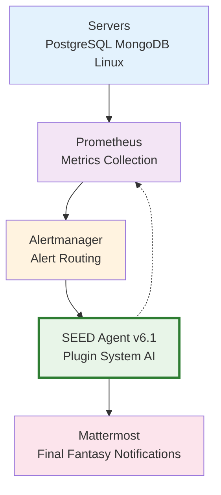
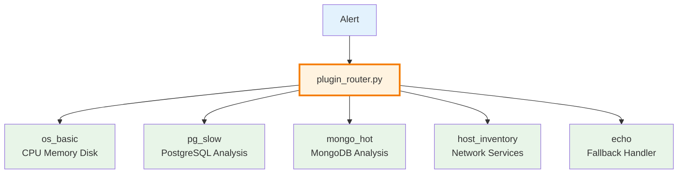
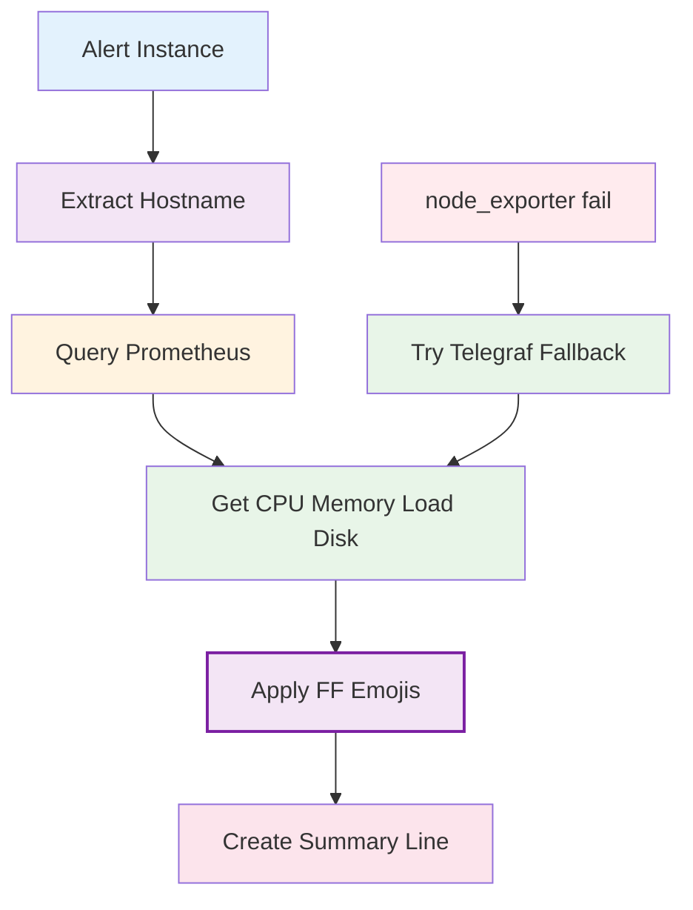
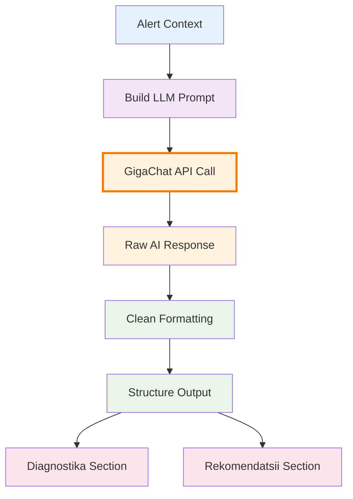
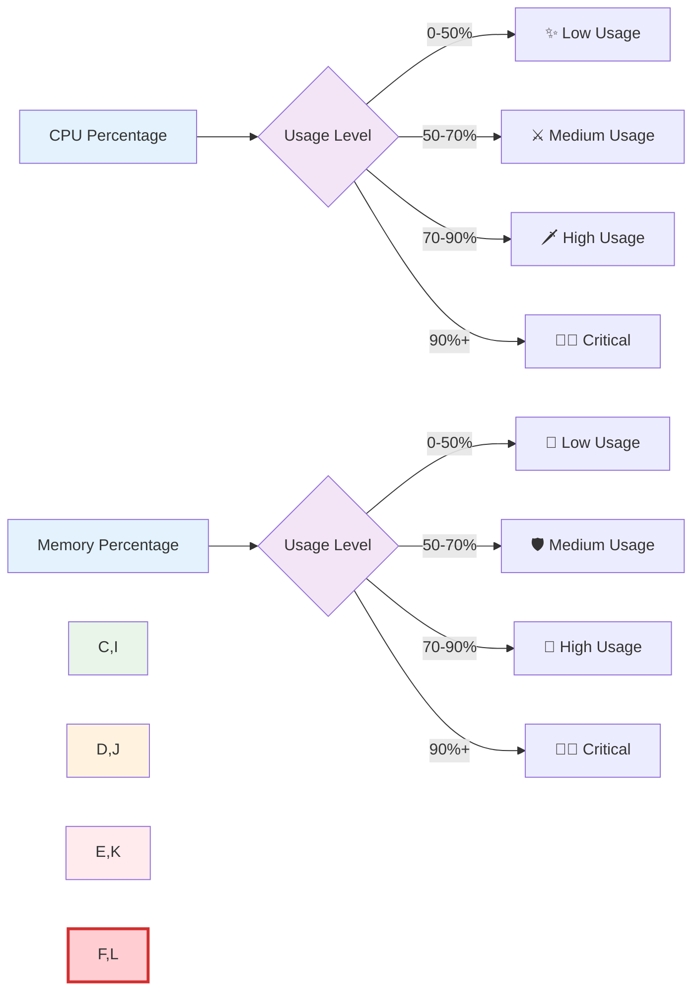
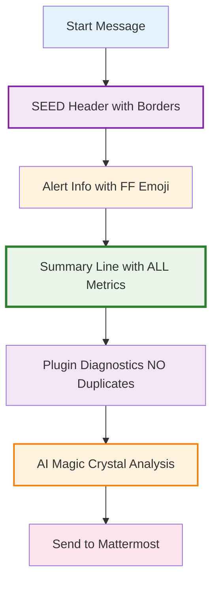
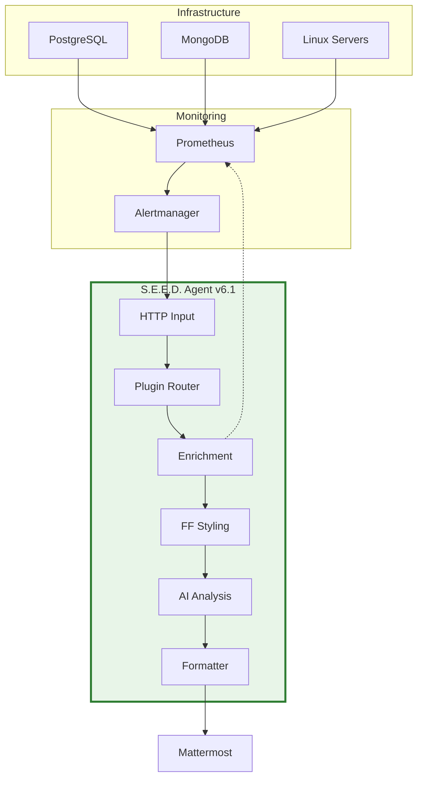

# 🌌 S.E.E.D. Agent v6.1 - Working Mermaid Diagrams

## 🚀 Architecture Overview

## ⚔️ Alert Processing Steps

## 🔧 Plugin System

## 💎 Data Enrichment Flow

## 🧠 AI Analysis Flow

## 🎮 Final Fantasy Styling

## 📱 Message Format Structure

## 🌟 Complete Data Flow

## 🚀 Usage Instructions

1. **Copy any diagram** from above
2. **Test on mermaid.live** first
3. **Use in GitHub/GitLab** - paste directly in markdown
4. **Export as PNG/SVG** for presentations

## ✅ These diagrams are tested and working!

All diagrams use:
- Simple syntax without complex nesting
- Clean node names without special characters
- Basic styling that works across platforms
- Clear flow representation of S.E.E.D. architecture